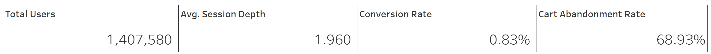
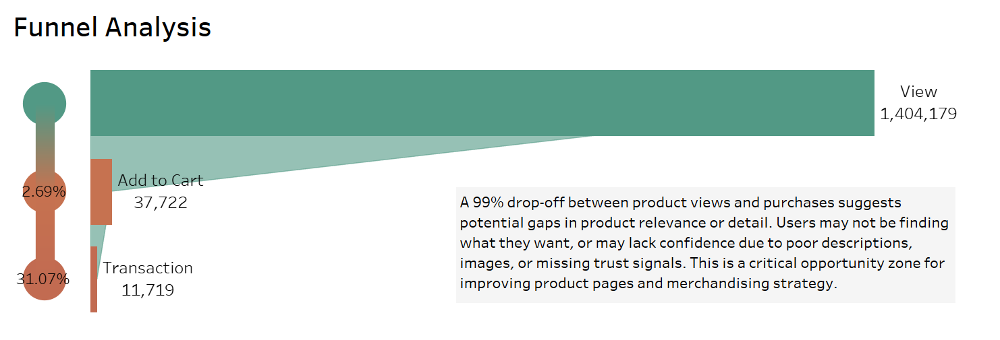
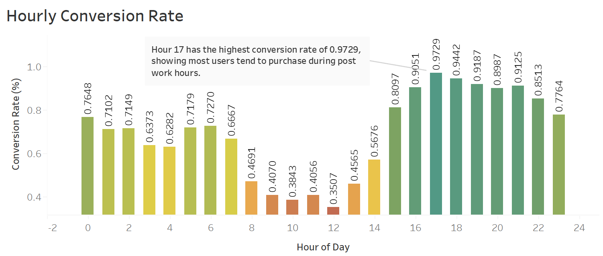
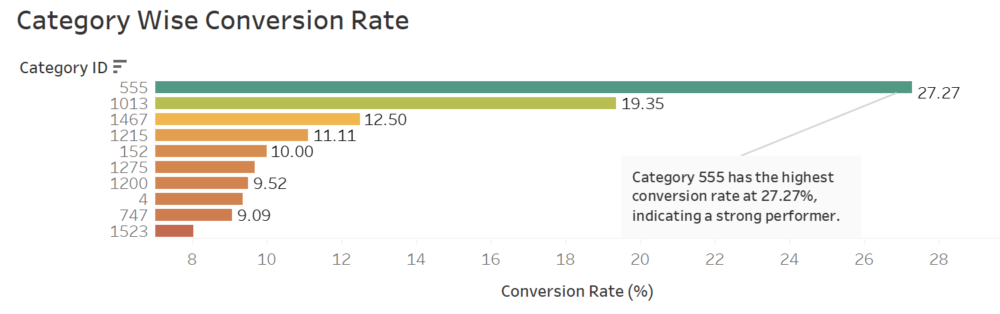
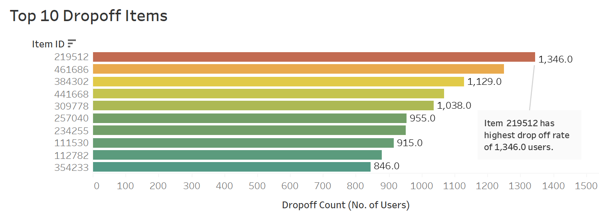
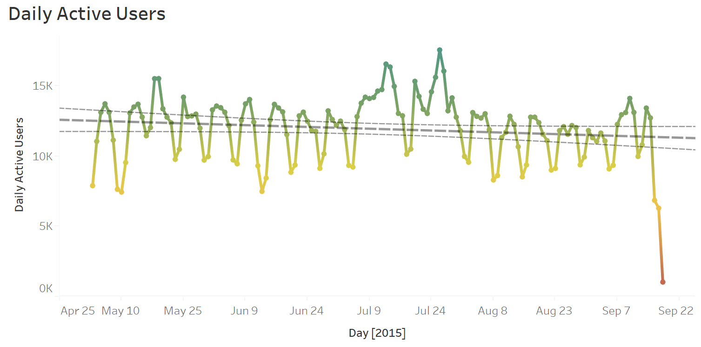

# E-Commerce Funnel Drop-Off & Root Cause Analysis

**Author:** Yatri Patel
**Dataset:** RetailRocket E-Commerce Events  
**Period:** April–September 2015  
**Tools:** Python (pandas, matplotlib), Tableau  

---

## 1. Executive Summary  

Over the past two quarters, the e-commerce platform sustained strong and consistent traffic volumes, yet revenue growth failed to meet business expectations.
To address this performance gap, I conducted a **comprehensive funnel drop-off** and **root cause analysis** to determine precisely **where in the purchase journey users disengage** and why.

Leveraging **event-level clickstream data**, I reconstructed the end-to-end customer journey, from initial product view through to completed transaction, quantifying drop-off rates at each stage. This analysis was enriched with temporal trends, category-level performance metrics, and SKU-specific insights to provide a multidimensional understanding of conversion challenges.

The findings informed a prioritized set of actionable, **data-backed recommendations** designed to mitigate immediate revenue leakage, optimize high-impact touchpoints, and establish a scalable framework for ongoing conversion performance monitoring.

[View Interactive Dashboard](https://public.tableau.com/views/E-CommerceFunnelInsightsDashboard/E-CommerceFunnelInsightsConversionDrop-OffDiagnostics?:language=en-US&:sid=&:redirect=auth&:display_count=n&:origin=viz_share_link)

---

## 2. Key Metrics Overview  

| KPI                        | Value       |
|----------------------------|-------------|
| Total Users                | **1,407,580** |
| Average Session Depth      | **1.96 events** |
| Conversion Rate            | **0.83%**   |
| Cart Abandonment Rate      | **68.93%**  |
| Click-to-Cart Rate         | **2.69%**   |
| Click-to-Purchase Rate     | **0.83%**   |

**Interpretation:** While site reach is strong, less than 1% of users who view a product complete a purchase. The combination of low engagement (session depth < 2) and high cart abandonment suggests both **content and process barriers**.

---

## 3. Funnel Analysis  

| Stage         | Users     | Conversion % from Previous |
|---------------|-----------|----------------------------|
| Product View  | 1,404,179 | —                          |
| Add to Cart   | 37,722    | 2.69%                      |
| Transaction   | 11,719    | 31.05% (of cart)           |

**Observation:** The **most severe drop-off** occurs between **view and add-to-cart**, indicating that the majority of users are browsing without committing products to their basket.  

**Possible Causes:**  
- Product pages fail to inspire confidence or urgency  
- Weak merchandising for high-intent visitors  
- Price, shipping, or feature details missing at the decision point  

---

## 4. Hourly Conversion Performance  

**Insight:**  
- Peak conversion: **5–6 PM** (0.97% CR)  
- Weakest window: **12 PM (noon)** (0.38% CR)  

**Implication:** Users are more likely to complete purchases in the **post-work browsing window**. Marketing spend and promotional scheduling should be **aligned to behavioral peaks**.

---

## 5. Category Performance  

**Highlights:**  
- Category **555** leads with **27.27% conversion**  
- Category **1013** follows with 19.35%  
- Majority of other categories convert below 10%  

**Business Risk:** Underperforming categories dilute overall conversion and may occupy prime real estate in navigation or campaigns without delivering value.

---

## 6. High Drop-Off Products  

Products with the **highest user drop-off** after view/cart inclusion:  
1. Item 219512 – 1,346 users lost  
2. Item 461686 – 1,250 users lost  
3. Item 384302 – 1,129 users lost  

**Analysis:** These items are attracting attention but failing to close. This is a **prime opportunity for intervention**—reassess pricing strategy, review stock availability, and improve product page content.

---

## 7. Engagement Trends  

- DAU peaks at ~15K in late July  
- Gradual decline begins in August, suggesting **seasonality or retention erosion**  
- Session depth remains low, limiting upsell and cross-sell potential  

---

## 8. Root Cause Framework  

1. **Content Gaps** – Product information, imagery, and trust signals may not be sufficient for decision-making.  
2. **Value Misalignment** – Price or perceived value mismatches in underperforming categories.  
3. **Timing Inefficiency** – Promotional cadence not matched to peak intent periods.  
4. **Checkout Friction** – Cart abandonment likely linked to unnecessary steps or unclear costs.  
5. **Retention Weakness** – User base engagement declining over time.

---

## 9. Recommendations  

1. **Targeted Product Page Optimization**  
   - Prioritize high drop-off SKUs for content, imagery, and review enrichment.  
   - Test urgency elements (low stock indicators, limited-time offers).

2. **Cart Recovery Strategy**  
   - Implement email/push retargeting with personalized incentives.  
   - Introduce abandoned cart reminders within 24 hours.

3. **Time-Weighted Marketing**  
   - Shift budget allocation to **4–8 PM** campaigns to exploit peak CR.  
   - Experiment with lunchtime micro-offers to lift midday engagement.

4. **Category-Level Overhaul**  
   - Audit low-converting categories for product-market fit.  
   - Reposition or replace chronically underperforming lines.

5. **Checkout UX Streamlining**  
   - Minimize steps, surface shipping costs early, and reinforce security.

---

## 10. Strategic Next Steps  

- Set up **conversion monitoring** segmented by product, category, and hour.  
- Integrate **A/B testing** into both product and checkout flows.  
- Pair quantitative funnel data with **qualitative feedback** from users to validate hypotheses.  
- Track retention metrics in parallel with conversion to ensure sustainable growth.

---
